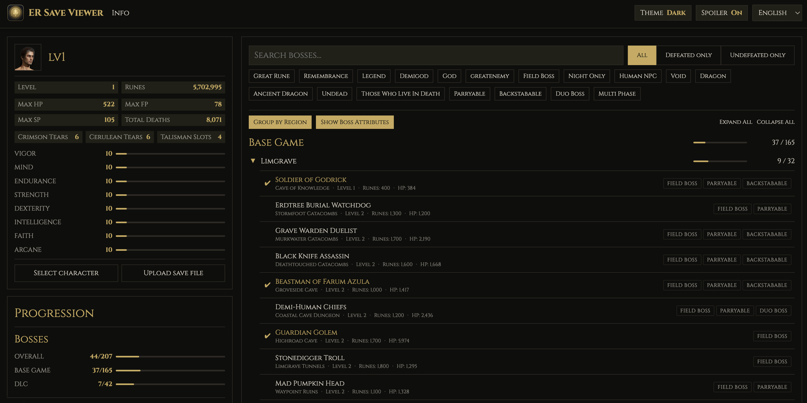

# ER Save Viewer

A web-based tool to analyze Elden Ring save files. View your boss progress, track event flags, inspect character stats, and explore damage negation and status resistances for every boss — all from your browser. Uses [er-save-parser](https://github.com/zebbedaja/er-save-parser), a TypeScript library for reading Elden Ring save files.

## Live Demo

https://zebbedaja.github.io/er-save-viewer/



## Features

- Browse and filter bosses by region, type, and defeat status
- Track event flags: story progress, maps, graces, items, and more
- View character stats, equipment, and progression details
- Inspect boss damage negation, status resistances, and inflicted effects
- Everything runs locally — your save never leaves your machine

## Credits

This project would not exist without the amazing work of the Elden Ring modding community. Special thanks to:

- [**Elden Ring Save Manager**](https://github.com/Hapfel1/er-save-manager) by Hapfel1 — Comprehensive save file editor, backup manager, and corruption fixer with character management, teleportation, and more.
- [**ER Save Editor**](https://github.com/ClayAmore/ER-Save-Editor) by ClayAmore — Save file editor with character management, item spawning, stat editing, boss revival, and more. Compatible with PC and PlayStation saves.
- [**ER Save Lib**](https://github.com/ClayAmore/ER-Save-Lib) by ClayAmore — Rust library for reading and writing Elden Ring save files. Compatible with PC and PlayStation saves.
- [**Smithbox**](https://github.com/vawser/Smithbox) by vawser — Modding toolkit for FromSoftware games with map, model, param, and texture editors.
- [**Souls Modding**](https://www.soulsmodding.com/) — Community hub for Dark Souls and Elden Ring modding with documentation, tutorials, and tools.
- [**Elden Ring Automatic Checklist**](https://github.com/CyberGiant7/Elden-Ring-Automatic-Checklist) by CyberGiant7 — Automated 100% completion checklist that parses save files to track owned and missing items.
- [**Elden Ring Compass**](https://github.com/EthanShoeDev/elden-ring-compass) by EthanShoeDev — Browser-based progression tracker with interactive maps, save polling, and completion stats.

## Development

```bash
npm install       # Install dependencies
npm run typecheck # Run TypeScript type check
npm run build     # Bundle with tsdown
npm run dev       # Start dev server
```

## License

MIT
